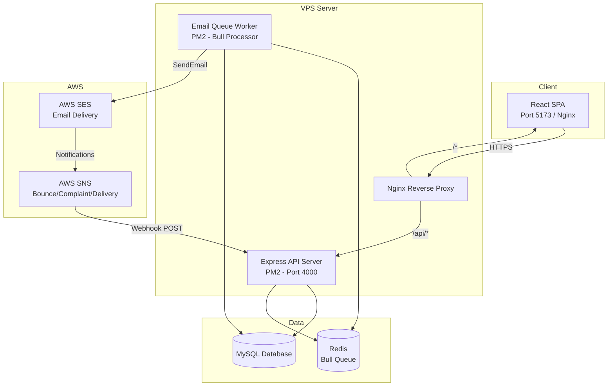
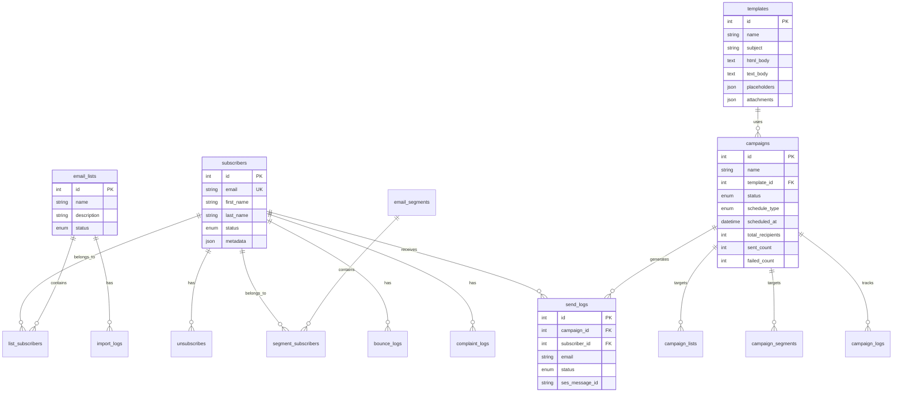
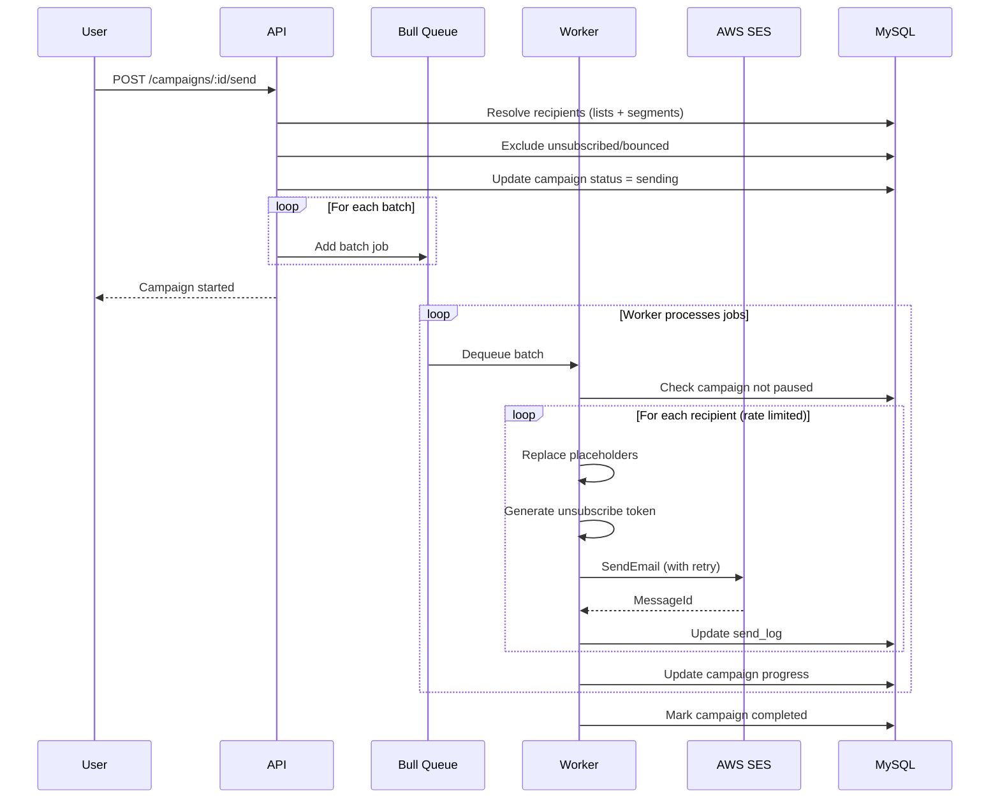

# Architecture & Deployment Guide

## System Architecture



## Component Overview

### Frontend (React + Vite + Tailwind)

- Single-page application served via Nginx in production
- Communicates with backend REST API
- Pages: Dashboard, Email Lists, Subscribers, Segments, Templates, Campaigns, Reports
- Public unsubscribe page (no auth required)

### Backend API (Node.js + Express)

- RESTful API with `/api/v1` prefix
- Sequelize ORM for MySQL
- Input validation via express-validator
- File upload for CSV/Excel import (multer)

### Email Worker (Bull + Redis)

- Separate PM2 process for queue consumption
- Processes campaign batches asynchronously
- Rate-limited sending to respect SES quotas
- Automatic retry with exponential backoff
- Campaign pause/resume support

### AWS SES Integration

- All AWS config read from environment variables
- `SESService` wrapper handles send, retry, and raw email (attachments)
- SNS webhook endpoint for bounce, complaint, and delivery events
- Credential swap requires only `.env` changes

## Database Schema



## Bulk Email Flow



## Environment Setup

### Development

| Service | URL/Port |
|---------|----------|
| Frontend | http://localhost:5173 |
| Backend API | http://localhost:4000 |
| MySQL | localhost:3306 |
| Redis | localhost:6379 |

### Staging / Production

| Service | Domain |
|---------|--------|
| Frontend | https://email.yourdomain.com |
| Backend API | https://api.email.yourdomain.com |
| SES Webhook | https://api.email.yourdomain.com/api/v1/webhooks/ses |

## Deployment Steps

### 1. Server Preparation

```bash
sudo apt update && sudo apt install -y nginx redis-server mysql-server
npm install -g pm2
```

### 2. Database Setup

```sql
CREATE DATABASE email_marketing CHARACTER SET utf8mb4 COLLATE utf8mb4_unicode_ci;
CREATE USER 'emailapp'@'localhost' IDENTIFIED BY 'secure_password';
GRANT ALL PRIVILEGES ON email_marketing.* TO 'emailapp'@'localhost';
FLUSH PRIVILEGES;
```

### 3. Application Deployment

```bash
cd /var/www/email-marketing/backend
cp .env.example .env
npm install --production
npm run migrate

cd /var/www/email-marketing/frontend
cp .env.example .env
npm install
npm run build
```

### 4. Start with PM2

```bash
pm2 start deployment/ecosystem.config.js --env production
pm2 save
pm2 startup
```

### 5. Configure Nginx

```bash
sudo cp deployment/nginx.conf /etc/nginx/sites-available/email-marketing
sudo ln -s /etc/nginx/sites-available/email-marketing /etc/nginx/sites-enabled/
sudo nginx -t && sudo systemctl reload nginx
```

## AWS Credential Migration Checklist

When moving from test to production SES:

- [ ] Production AWS account created and SES configured
- [ ] Sending domain verified with SPF/DKIM/DMARC
- [ ] Production access approved (out of sandbox)
- [ ] SNS topics configured for production
- [ ] Update `.env` with production credentials only
- [ ] Restart PM2 processes: `pm2 restart all`
- [ ] Send test email to verify delivery
- [ ] Verify webhook processing (bounce/complaint)
- [ ] Verify unsubscribe flow end-to-end
- [ ] Run small batch campaign smoke test
