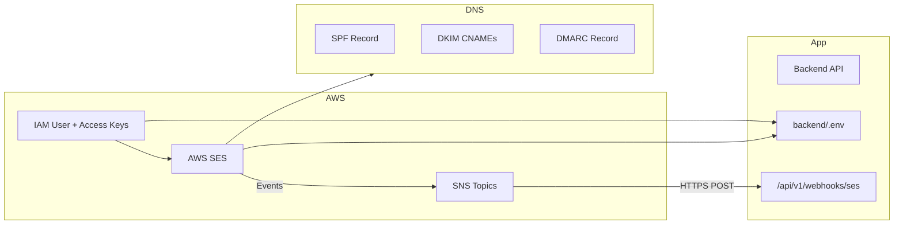

# AWS IAM User & SES Setup Guide

**For:** Email Marketing Application Developers  
**Purpose:** Create a dedicated IAM user (not root) and configure AWS SES end-to-end for this project  
**Last updated:** June 2026

---

## Table of Contents

1. [Overview](#1-overview)
2. [What You Will Configure](#2-what-you-will-configure)
3. [Before You Start](#3-before-you-start)
4. [Sandbox Path — No Domain Required](#4-sandbox-path--no-domain-required)
5. [Step 1 — Sign In as Root (One-Time Only)](#5-step-1--sign-in-as-root-one-time-only)
6. [Step 2 — Create IAM User for SES](#6-step-2--create-iam-user-for-ses)
7. [Step 3 — Create IAM Policy (Least Privilege)](#7-step-3--create-iam-policy-least-privilege)
8. [Step 4 — Generate Access Keys](#8-step-4--generate-access-keys)
9. [Step 5 — Choose AWS Region](#9-step-5--choose-aws-region)
10. [Step 6 — Verify Your Sending Domain](#10-step-6--verify-your-sending-domain)
11. [Step 7 — Add DNS Records (SPF, DKIM, DMARC)](#11-step-7--add-dns-records-spf-dkim-dmarc)
12. [Step 8 — Configure MAIL FROM Domain (Recommended)](#12-step-8--configure-mail-from-domain-recommended)
13. [Step 9 — Set Up SNS for Bounce, Complaint & Delivery Events](#13-step-9--set-up-sns-for-bounce-complaint--delivery-events)
14. [Step 10 — Connect SNS to Application Webhook](#14-step-10--connect-sns-to-application-webhook)
15. [Step 11 — Request Production Access (Leave Sandbox)](#15-step-11--request-production-access-leave-sandbox)
16. [Step 12 — Configure Application `.env`](#16-step-12--configure-application-env)
17. [Step 13 — Test SES Integration](#17-step-13--test-ses-integration)
18. [Development vs Production Accounts](#18-development-vs-production-accounts)
19. [IAM Policy Reference (Copy-Paste)](#19-iam-policy-reference-copy-paste)
20. [DNS Record Cheat Sheet](#20-dns-record-cheat-sheet)
21. [Troubleshooting](#21-troubleshooting)
22. [Security Checklist](#22-security-checklist)
23. [Quick Reference Card](#23-quick-reference-card)

---

## 1. Overview

### Do NOT use the AWS root user for daily work

| User Type | When to Use |
|-----------|-------------|
| **Root user** | One-time: create IAM users, enable MFA on root, billing setup |
| **IAM user** | All SES setup, sending emails, managing configuration |

This guide walks you through:

1. Logging in as **root** once to create an IAM user
2. Using that **IAM user** for all SES configuration
3. Wiring SES → SNS → your application webhook
4. Putting credentials into `backend/.env`

### Choose your setup path

| Path | When to use | Domain required? |
|------|-------------|------------------|
| **[Sandbox (no domain)](#4-sandbox-path--no-domain-required)** | Local dev, demos, first integration tests | No — verify individual email addresses only |
| **Full production setup** | Real campaigns, bulk sending, production | Yes — Steps 6–11 |

> **No domain yet?** Start with [Section 4 — Sandbox Path](#4-sandbox-path--no-domain-required). You can complete domain verification and production access later without changing application code.

> **Important:** This application reads AWS config **only from `.env`**. No code changes are needed when switching from test to production credentials.

---

## 2. What You Will Configure



### Application requirements mapped to AWS

| Application Need | AWS Configuration |
|-----------------|-------------------|
| `AWS_ACCESS_KEY_ID` / `AWS_SECRET_ACCESS_KEY` | IAM user access keys |
| `AWS_REGION` | SES region (e.g. `us-east-1`) |
| `SES_FROM_EMAIL` | Verified domain email (e.g. `noreply@yourdomain.com`) — or any **verified email address** in sandbox |
| `SES_FROM_NAME` | Display name (app config only) |
| Bounce tracking | SNS → webhook |
| Complaint tracking | SNS → webhook |
| Delivery tracking | SNS → webhook |
| Bulk sending | Production access (out of sandbox) |

---

## 3. Before You Start

### Collect this information first

**Sandbox path (no domain):**

| Item | Example | Your Value |
|------|---------|------------|
| AWS Account ID | `123456789012` | _____________ |
| Sender email (must be real inbox you control) | `you@gmail.com` | _____________ |
| Test recipient email(s) | `colleague@gmail.com` | _____________ |
| AWS Region | `us-east-1` | _____________ |

**Full setup path (with domain):**

| Item | Example | Your Value |
|------|---------|------------|
| AWS Account ID | `123456789012` | _____________ |
| Sending domain | `yourdomain.com` | _____________ |
| From email address | `noreply@yourdomain.com` | _____________ |
| AWS Region | `us-east-1` | _____________ |
| API webhook URL (dev) | `https://api-dev.yourdomain.com/api/v1/webhooks/ses` | _____________ |
| API webhook URL (prod) | `https://api.email.yourdomain.com/api/v1/webhooks/ses` | _____________ |
| DNS provider access | Cloudflare / Route 53 / GoDaddy | _____________ |

### Prerequisites

**Sandbox path:**
- [ ] AWS root account login (for IAM user creation only)
- [ ] A real email address you can access (for sender verification)
- [ ] One or more test recipient emails you can verify in SES
- [ ] Backend API running locally (`npm run dev` + `npm run worker`)

**Full setup path (additionally):**
- [ ] Access to your domain's DNS management panel
- [ ] Backend API deployed and publicly reachable (for SNS HTTPS subscription in staging/production)
- [ ] For local dev: use a tunnel tool (ngrok / Cloudflare Tunnel) if testing webhooks locally

### Recommended naming convention

| Resource | Suggested Name |
|----------|---------------|
| IAM User | `email-marketing-ses` |
| IAM Policy | `EmailMarketingSESPolicy` |
| SNS Topic (bounces) | `ses-bounces` |
| SNS Topic (complaints) | `ses-complaints` |
| SNS Topic (delivery) | `ses-delivery` |
| SES Configuration Set | `email-marketing-config` |

---

## 4. Sandbox Path — No Domain Required

Use this path when you **do not own a sending domain** yet but need to run and test the email marketing application locally or in a dev environment.

New AWS accounts start in **SES sandbox mode** automatically. Sandbox mode works with **verified email addresses** only — no DNS records or domain purchase required.

### What you will and won't do

| Step | Sandbox path | Full setup path |
|------|--------------|-----------------|
| Steps 1–5 (IAM, keys, region) | ✅ Required | ✅ Required |
| Step 6 — Domain verification | ⏭️ Skip | ✅ Required |
| Step 7 — DNS (SPF, DKIM, DMARC) | ⏭️ Skip | ✅ Required |
| Step 8 — MAIL FROM domain | ⏭️ Skip | ✅ Recommended |
| Steps 9–10 — SNS webhooks | ⚠️ Optional for first send test | ✅ Required |
| Step 11 — Production access | ⏭️ Skip until you have a domain | ✅ Required for bulk sending |
| Steps 12–13 — `.env` + testing | ✅ Required (sandbox values) | ✅ Required |

### Sandbox limitations (important)

| Restriction | What it means for you |
|-------------|----------------------|
| **Verified recipients only** | Every email you send to must be verified in SES first (or use SES mailbox simulators) |
| **Verified sender only** | `SES_FROM_EMAIL` must be a verified email address — not an unverified `@yourdomain.com` |
| **200 emails/day** | Enough for development and QA |
| **1 email/second** | Set `EMAIL_RATE_LIMIT_PER_SECOND=1` in `.env` |
| **No real bulk campaigns** | Cannot send to arbitrary subscriber lists until you leave sandbox |

### 4.1 Confirm sandbox mode

1. Sign in as your IAM user (`email-marketing-ses`)
2. Open **SES** → **Account dashboard** (ensure correct region, e.g. `us-east-1`)
3. Under **Sending status**, you should see **Sandbox**

If it already shows **Production**, you can still use verified emails, but the recipient restriction may be lifted.

### 4.2 Verify your sender email address

This becomes your `SES_FROM_EMAIL`. Use a real inbox you control (Gmail, Outlook, work email, etc.).

1. **SES** → **Verified identities** → **Create identity**
2. Configure:

| Field | Value |
|-------|-------|
| Identity type | **Email address** |
| Email address | `you@gmail.com` (your real sender) |

3. Click **Create identity**
4. Open the verification email from AWS and click the link
5. In **Verified identities**, status should show **Verified**

> **Tip:** Gmail and most providers work fine. Avoid disposable email services — SES may reject them.

### 4.3 Verify test recipient email addresses

In sandbox, **every recipient** must also be verified — you cannot send to random addresses.

For each person who will receive test emails:

1. **SES** → **Verified identities** → **Create identity**
2. Identity type: **Email address**
3. Enter the recipient email (e.g. `teammate@gmail.com`)
4. They must click the verification link in their inbox

**Alternative — SES mailbox simulators (no inbox needed):**

These special addresses simulate delivery events and work without verification:

| Address | Simulates |
|---------|-----------|
| `success@simulator.amazonses.com` | Successful delivery |
| `bounce@simulator.amazonses.com` | Hard bounce |
| `complaint@simulator.amazonses.com` | Spam complaint |
| `suppressionlist@simulator.amazonses.com` | Suppressed address |

Add simulator addresses as subscribers in the app for automated bounce/complaint testing.

### 4.4 Complete IAM setup (Steps 1–5)

If you have not already:

1. [Step 1](#5-step-1--sign-in-as-root-one-time-only) — Create IAM user (root, one-time)
2. [Step 2](#6-step-2--create-iam-user-for-ses) — IAM user `email-marketing-ses`
3. [Step 3](#7-step-3--create-iam-policy-least-privilege) — Attach `EmailMarketingSESPolicy`
4. [Step 4](#8-step-4--generate-access-keys) — Generate access keys
5. [Step 5](#9-step-5--choose-aws-region) — Choose region (e.g. `us-east-1`)

### 4.5 Configure `backend/.env` for sandbox

Copy `backend/.env.example` to `backend/.env`:

```env
# AWS SES — from IAM access keys (Step 4)
AWS_ACCESS_KEY_ID=AKIA....................
AWS_SECRET_ACCESS_KEY=........................................
AWS_REGION=us-east-1

# Verified sender email (Section 4.2) — NOT a domain address
SES_FROM_EMAIL=you@gmail.com
SES_FROM_NAME=Email Marketing Dev

# Local URLs for development
APP_URL=http://localhost:3000
API_URL=http://localhost:4000

# Sandbox rate limits
EMAIL_BATCH_SIZE=10
EMAIL_RATE_LIMIT_PER_SECOND=1
EMAIL_MAX_RETRIES=3
EMAIL_RETRY_DELAY_MS=5000
```

| Variable | Sandbox note |
|----------|--------------|
| `SES_FROM_EMAIL` | Must exactly match a **verified email identity** in SES |
| `EMAIL_RATE_LIMIT_PER_SECOND` | Must be `1` in sandbox |
| `APP_URL` / `API_URL` | Use `localhost` for local dev |

Restart after changes:

```bash
cd backend
npm run dev        # terminal 1
npm run worker     # terminal 2
```

### 4.6 Send your first sandbox test

1. Confirm health check:
   ```bash
   curl http://localhost:4000/api/v1/health
   ```

2. In the app UI:
   - Create a subscriber list
   - Add **only verified recipient emails** (Section 4.3)
   - Create a simple HTML template with `{{unsubscribe_url}}`
   - Create a campaign → select list + template → **Send**

3. Watch worker logs for send status:
   ```bash
   # If using pm2:
   pm2 logs email-marketing-worker
   ```

4. Check the recipient inbox (and spam folder)

5. Confirm in database:
   ```sql
   SELECT id, email, status, ses_message_id, sent_at, error_message
   FROM send_logs
   ORDER BY id DESC
   LIMIT 10;
   ```
   Expected status: `sent`

### 4.7 SNS webhooks in sandbox (optional)

Bounce and delivery tracking via SNS requires a **public HTTPS** webhook URL. For local-only sandbox testing, you can skip Steps 9–10 initially and still verify that emails send.

When you are ready to test webhooks locally:

1. Complete [Steps 9–10](#13-step-9--set-up-sns-for-bounce-complaint--delivery-events) (SNS topics + configuration set)
2. Use [ngrok](#14-step-10--connect-sns-to-application-webhook) to expose `http://localhost:4000`
3. Subscribe SNS to `https://<ngrok-id>.ngrok-free.app/api/v1/webhooks/ses`

### 4.8 Common sandbox errors

| Error | Cause | Fix |
|-------|-------|-----|
| `MessageRejected: Email address is not verified` | Recipient not verified in SES | Verify recipient in Section 4.3, or use a simulator address |
| `MessageRejected: Email address is not verified` (sender) | `SES_FROM_EMAIL` doesn't match verified identity | Re-check Section 4.2; `.env` must match exactly |
| `Throttling` | Exceeded 1 email/second | Set `EMAIL_RATE_LIMIT_PER_SECOND=1` |
| Emails queued but not sent | Worker not running | Run `npm run worker` in a second terminal |
| Daily quota exceeded | Sent more than 200/day | Wait 24 hours or request production access |

### 4.9 When you're ready for production

Once you have a domain:

1. Complete [Step 6](#10-step-6--verify-your-sending-domain) — Verify sending domain
2. Complete [Step 7](#11-step-7--add-dns-records-spf-dkim-dmarc) — Add DNS records
3. Complete [Steps 8–10](#12-step-8--configure-mail-from-domain-recommended) — MAIL FROM + SNS webhooks
4. Complete [Step 11](#15-step-11--request-production-access-leave-sandbox) — Request production access
5. Update `.env`:
   ```env
   SES_FROM_EMAIL=noreply@yourdomain.com
   EMAIL_RATE_LIMIT_PER_SECOND=14
   APP_URL=https://email.yourdomain.com
   API_URL=https://api.email.yourdomain.com
   ```

No application code changes are required — only AWS configuration and `.env` updates.

---

## 5. Step 1 — Sign In as Root (One-Time Only)

1. Go to [https://aws.amazon.com/console/](https://aws.amazon.com/console/)
2. Sign in with **root user** email and password
3. Complete MFA if enabled (recommended for root)

> After creating the IAM user in Step 2, **stop using root** for SES work.

### Secure the root account (recommended)

1. Go to **IAM** → **Dashboard**
2. Enable **MFA** on root account
3. Note the security recommendations and resolve critical ones

---

## 6. Step 2 — Create IAM User for SES

### 5.1 Open IAM Console

1. In AWS Console search bar, type **IAM**
2. Click **IAM** → **Users** → **Create user**

### 5.2 User details

| Field | Value |
|-------|-------|
| User name | `email-marketing-ses` |
| Provide user access to AWS Console | ✅ **Yes** (optional but helpful for SES console setup) |

Click **Next**.

### 5.3 Set permissions

Choose: **Attach policies directly**

Do **not** attach `AdministratorAccess`. Instead, create a custom policy (Step 3), then attach it.

Click **Next** → **Create user**.

### 5.4 Create console login (optional)

If you enabled console access:

1. Open the user `email-marketing-ses`
2. Go to **Security credentials** tab
3. Under **Console sign-in**, click **Enable console access**
4. Set a strong password
5. Require password reset on first login

### 5.5 Sign out and sign in as IAM user

1. Sign out of root account
2. Sign in at: `https://<account-id>.signin.aws.amazon.com/console`
3. Use IAM user name: `email-marketing-ses`

> **From this point forward, complete all SES setup using the IAM user.**

---

## 7. Step 3 — Create IAM Policy (Least Privilege)

### 6.1 Create the policy

1. Go to **IAM** → **Policies** → **Create policy**
2. Click **JSON** tab
3. Paste the policy from [Section 19](#19-iam-policy-reference-copy-paste)
4. Click **Next**
5. Policy name: `EmailMarketingSESPolicy`
6. Description: `SES send + SNS setup for Email Marketing Application`
7. Click **Create policy**

### 6.2 Attach policy to IAM user

1. Go to **IAM** → **Users** → `email-marketing-ses`
2. **Permissions** tab → **Add permissions** → **Attach policies directly**
3. Search `EmailMarketingSESPolicy` → select → **Add permissions**

### What this policy allows

| Service | Permissions | Why |
|---------|------------|-----|
| SES | SendEmail, SendRawEmail | Send campaign emails |
| SES | VerifyDomainIdentity, DKIM | Domain verification |
| SES | Configuration sets | Event tracking setup |
| SNS | CreateTopic, Subscribe | Bounce/complaint/delivery webhooks |

### What this policy does NOT allow

- Billing changes
- Creating other IAM users
- Access to unrelated AWS services (EC2, S3, etc.)

---

## 8. Step 4 — Generate Access Keys

> **Do this while signed in as the IAM user** (or as root attaching keys to that user).

1. Go to **IAM** → **Users** → `email-marketing-ses`
2. **Security credentials** tab
3. Scroll to **Access keys** → **Create access key**
4. Use case: **Application running outside AWS**
5. Click **Create access key**

### Save credentials immediately

You will see:

```
Access key ID:     AKIA....................
Secret access key: ........................................
```

| Credential | Goes in `.env` as |
|-----------|-------------------|
| Access key ID | `AWS_ACCESS_KEY_ID` |
| Secret access key | `AWS_SECRET_ACCESS_KEY` |

> **Warning:** The secret key is shown **only once**. Store it in a password manager or secrets vault. Never commit to Git.

### Rotate keys periodically

- Create a new key before deleting the old one
- Update `backend/.env`
- Restart API + worker: `pm2 restart all`

---

## 9. Step 5 — Choose AWS Region

SES is **region-specific**. Pick one region and use it consistently.

### Recommended regions

| Region | Code | Notes |
|--------|------|-------|
| US East (N. Virginia) | `us-east-1` | Most common, default in project |
| US West (Oregon) | `us-west-2` | Good alternative |
| EU (Ireland) | `eu-west-1` | If recipients are primarily in EU |
| Asia Pacific (Mumbai) | `ap-south-1` | If recipients are primarily in India |

### Set region in console

1. Top-right corner of AWS Console → select your region (e.g. **US East (N. Virginia)**)
2. All SES and SNS setup must be done in **the same region**

### Set region in `.env`

```env
AWS_REGION=us-east-1
```

> If you change region later, you must re-verify your domain in the new region.

---

## 10. Step 6 — Verify Your Sending Domain

> **No domain?** Use the [Sandbox Path (Section 4)](#4-sandbox-path--no-domain-required) instead — verify individual email addresses and skip this step.

Domain verification is **required** before you can send from `@yourdomain.com` addresses.

### 9.1 Open SES Console

1. Search **SES** in AWS Console (ensure correct region is selected)
2. In the left menu, click **Verified identities** (or **Identities** in new console)
3. Click **Create identity**

### 9.2 Create domain identity

| Field | Value |
|-------|-------|
| Identity type | **Domain** |
| Domain | `yourdomain.com` |
| Assign a default configuration set | Leave unchecked for now (set up in Step 12) |
| Use a custom MAIL FROM domain | Leave unchecked for now (Step 11) |
| Verifying your domain | **Easy DKIM** (recommended) |
| DKIM signing key length | **RSA_2048_BIT** |
| Publish DNS records to Route 53 | Only if domain is in Route 53; otherwise manual |

Click **Create identity**.

### 9.3 Copy DNS records from SES

SES will show records you must add to your DNS provider:

- **1 TXT record** — domain verification
- **3 CNAME records** — DKIM signing

Keep this page open. You will add these in Step 7.

### 9.4 Alternative: Verify a single email (sandbox testing only)

For quick sandbox testing without DNS access, see the full walkthrough in [Section 4 — Sandbox Path](#4-sandbox-path--no-domain-required).

Summary:

1. **Create identity** → type: **Email address**
2. Enter your real sender email (e.g. `you@gmail.com`)
3. Check inbox for verification link and click it
4. Verify each test recipient the same way

> For production bulk sending, **domain verification is required**. Single-email verification is not sufficient for campaigns.

---

## 11. Step 7 — Add DNS Records (SPF, DKIM, DMARC)

Log in to your DNS provider (Cloudflare, Route 53, GoDaddy, etc.) and add the following records.

### 10.1 Domain verification (TXT) — from SES console

| Type | Name / Host | Value |
|------|------------|-------|
| TXT | `_amazonses.yourdomain.com` | `(value shown in SES console)` |

> Some DNS providers want only `_amazonses` as the host if the domain is already selected.

### 10.2 DKIM (3 CNAME records) — from SES console

SES provides 3 CNAME records like:

| Type | Name / Host | Value / Points to |
|------|------------|-------------------|
| CNAME | `abc123._domainkey.yourdomain.com` | `abc123.dkim.amazonses.com` |
| CNAME | `def456._domainkey.yourdomain.com` | `def456.dkim.amazonses.com` |
| CNAME | `ghi789._domainkey.yourdomain.com` | `ghi789.dkim.amazonses.com` |

Copy the **exact** values from your SES console — they are unique per account.

### 10.3 SPF record (TXT)

Add or update SPF on your root domain:

| Type | Name / Host | Value |
|------|------------|-------|
| TXT | `@` or `yourdomain.com` | `v=spf1 include:amazonses.com ~all` |

**Rules:**
- Only **one** SPF TXT record per domain
- If SPF already exists, **merge** rather than create a duplicate:

```
# Existing:
v=spf1 include:_spf.google.com ~all

# Merged with SES:
v=spf1 include:_spf.google.com include:amazonses.com ~all
```

### 10.4 DMARC record (TXT) — recommended

| Type | Name / Host | Value |
|------|------------|-------|
| TXT | `_dmarc.yourdomain.com` | `v=DMARC1; p=none; rua=mailto:dmarc@yourdomain.com` |

**DMARC policy progression:**

| Phase | Policy | Meaning |
|-------|--------|---------|
| Monitoring | `p=none` | Collect reports, don't reject |
| Quarantine | `p=quarantine` | Suspect emails go to spam |
| Reject | `p=reject` | Reject failing emails (production-ready) |

Start with `p=none`, move to `p=quarantine` after confirming DKIM/SPF pass consistently.

### 10.5 Verify in SES console

1. Return to **SES** → **Verified identities** → click your domain
2. Wait for status to change to **Verified** (can take 15 minutes to 72 hours)
3. DKIM status should show **Successful**

| Status | Meaning |
|--------|---------|
| Pending | DNS not propagated yet — wait and recheck |
| Verified | Ready to send from `@yourdomain.com` |
| Failed | DNS record incorrect — double-check host/value |

### 10.6 Test DNS propagation

```bash
# Check domain verification TXT
dig TXT _amazonses.yourdomain.com +short

# Check DKIM CNAME
dig CNAME abc123._domainkey.yourdomain.com +short

# Check SPF
dig TXT yourdomain.com +short

# Check DMARC
dig TXT _dmarc.yourdomain.com +short
```

---

## 12. Step 8 — Configure MAIL FROM Domain (Recommended)

A custom MAIL FROM domain improves deliverability and aligns SPF with SES.

### 11.1 In SES Console

1. **Verified identities** → click `yourdomain.com`
2. Go to **MAIL FROM domain** tab
3. Click **Edit** or **Set up MAIL FROM domain**

| Field | Value |
|-------|-------|
| MAIL FROM domain | `mail.yourdomain.com` |
| Behavior on MX failure | **Use default MAIL FROM domain** |

### 11.2 Add DNS records for MAIL FROM

SES will show two records to add:

| Type | Name / Host | Value |
|------|------------|-------|
| MX | `mail.yourdomain.com` | `10 feedback-smtp.us-east-1.amazonses.com` |
| TXT | `mail.yourdomain.com` | `v=spf1 include:amazonses.com ~all` |

> Replace `us-east-1` in the MX value with your actual SES region.

### 11.3 Verify MAIL FROM status

In SES identity details, MAIL FROM status should show **Successful**.

---

## 13. Step 9 — Set Up SNS for Bounce, Complaint & Delivery Events

Your application tracks bounces, complaints, and deliveries via the webhook endpoint:

```
POST /api/v1/webhooks/ses
```

SES sends events to **SNS**, and SNS forwards them to your API.

### 12.1 Create SNS Topics

Go to **SNS** → **Topics** → **Create topic** (create three topics):

| Topic name | Purpose |
|-----------|---------|
| `ses-bounces` | Hard/soft bounces |
| `ses-complaints` | Spam complaints |
| `ses-delivery` | Successful deliveries |

For each topic:
1. Type: **Standard**
2. Name: as above
3. Click **Create topic**
4. Copy the **Topic ARN** (you'll need it later)

Example ARN format:
```
arn:aws:sns:us-east-1:123456789012:ses-bounces
```

### 12.2 Create SES Configuration Set

1. Go to **SES** → **Configuration sets** → **Create set**
2. Name: `email-marketing-config`
3. Click **Create**

### 12.3 Add Event Destinations to Configuration Set

Open `email-marketing-config` → **Event destinations** → **Add destination**

Create **three** event destinations:

#### Destination 1 — Bounces

| Field | Value |
|-------|-------|
| Event destination name | `bounce-destination` |
| Event types | ✅ Bounce |
| Destination type | **Amazon SNS** |
| SNS topic | `ses-bounces` |

#### Destination 2 — Complaints

| Field | Value |
|-------|-------|
| Event destination name | `complaint-destination` |
| Event types | ✅ Complaint |
| Destination type | **Amazon SNS** |
| SNS topic | `ses-complaints` |

#### Destination 3 — Deliveries

| Field | Value |
|-------|-------|
| Event destination name | `delivery-destination` |
| Event types | ✅ Delivery |
| Destination type | **Amazon SNS** |
| SNS topic | `ses-delivery` |

### 12.4 Link Configuration Set to Sending Identity

1. **SES** → **Verified identities** → `yourdomain.com`
2. **Configuration set** tab → **Edit**
3. Select `email-marketing-config` as default
4. Save

> When sending via the application, emails will automatically use this configuration set if it's set as the identity default. The app's `SendEmail` API uses the verified `SES_FROM_EMAIL` domain identity.

---

## 14. Step 10 — Connect SNS to Application Webhook

### 13.1 Webhook URL

Your backend exposes this endpoint (no authentication — SNS calls it directly):

| Environment | Webhook URL |
|------------|-------------|
| Development (tunnel) | `https://<your-ngrok-id>.ngrok.io/api/v1/webhooks/ses` |
| Staging | `https://api-staging.yourdomain.com/api/v1/webhooks/ses` |
| Production | `https://api.email.yourdomain.com/api/v1/webhooks/ses` |

> The API must be **publicly accessible over HTTPS** for SNS to deliver events.

### 13.2 Subscribe HTTPS endpoint to each SNS topic

For **each** of the three topics (`ses-bounces`, `ses-complaints`, `ses-delivery`):

1. Go to **SNS** → **Topics** → click the topic
2. Click **Create subscription**
3. Configure:

| Field | Value |
|-------|-------|
| Protocol | **HTTPS** |
| Endpoint | `https://api.email.yourdomain.com/api/v1/webhooks/ses` |
| Enable raw message delivery | **Disabled** |

4. Click **Create subscription**
5. Status will show **Pending confirmation**

### 13.3 Confirm subscription

SNS sends a `SubscriptionConfirmation` message to your webhook.

**Option A — Automatic (if API is running):**

Your application's webhook handler logs the confirmation URL. Check API logs:

```bash
pm2 logs email-marketing-api
# Look for: SNS Subscription URL: https://sns.us-east-1.amazonaws.com/...
```

Visit that URL in a browser to confirm.

**Option B — Manual from SNS console:**

1. Go to the SNS topic → **Subscriptions**
2. If status is still **Pending confirmation**, check that your API is reachable
3. You can also confirm via the `SubscribeURL` in the SNS message payload

### 13.4 Verify subscriptions

All three subscriptions should show status: **Confirmed**

| Topic | Protocol | Status |
|-------|----------|--------|
| ses-bounces | HTTPS | Confirmed |
| ses-complaints | HTTPS | Confirmed |
| ses-delivery | HTTPS | Confirmed |

### 13.5 Local development with ngrok

If testing webhooks locally:

```bash
# Terminal 1 — start API
cd backend && npm run dev

# Terminal 2 — expose via ngrok
ngrok http 4000
```

Use the ngrok HTTPS URL as your SNS subscription endpoint:
```
https://abc123.ngrok-free.app/api/v1/webhooks/ses
```

> ngrok URL changes on restart — update SNS subscriptions each time.

---

## 15. Step 11 — Request Production Access (Leave Sandbox)

New SES accounts start in **sandbox mode**.

### Sandbox limitations

| Restriction | Sandbox | Production |
|------------|---------|------------|
| Send to any email | ❌ Only verified addresses | ✅ Any recipient |
| Daily send limit | 200 emails/day | Starts at 50,000/day (increases over time) |
| Send rate | 1 email/second | 14+ emails/second (increases over time) |
| Bulk campaigns | ❌ Not practical | ✅ Supported |

### Request production access

1. **SES** → left menu → **Account dashboard** (or **Getting started**)
2. Click **Request production access** (or **View Get set up page** → **Request production access**)
3. Fill the form:

| Field | Suggested Answer |
|-------|-----------------|
| Mail type | **Transactional** and/or **Marketing** |
| Website URL | Your application URL |
| Use case description | See template below |
| Expected daily volume | Your estimate (e.g. 10,000/day) |
| How you handle bounces/complaints | See template below |
| Do you have a process to handle complaints? | **Yes** |
| Do you have DKIM, SPF, DMARC? | **Yes** (after Step 7) |

**Use case description template:**

```
We operate an internal email marketing application for sending 
newsletters and transactional emails to opted-in subscribers. 
Recipients subscribe via our platform and can unsubscribe via 
a one-click link included in every email. We process bounces 
and complaints via SNS webhooks and immediately suppress 
affected addresses from future sends.
```

**Bounce/complaint handling template:**

```
Bounces and complaints are received via AWS SNS webhooks at our 
API endpoint. Hard bounces and complaints automatically update 
subscriber status to 'bounced' or 'complained' and exclude them 
from all future campaigns. We maintain unsubscribe and bounce 
suppression lists in our MySQL database.
```

4. Submit the request
5. AWS typically responds within **24–48 hours** (sometimes up to 7 days)

### While waiting for approval

- Test with **verified email addresses** only
- Set in `.env`:
  ```env
  EMAIL_RATE_LIMIT_PER_SECOND=1
  ```
- Verify full flow: send → delivery webhook → bounce handling → unsubscribe

### After approval

1. Check **Account dashboard** — status should show **Production**
2. Update `.env`:
   ```env
   EMAIL_RATE_LIMIT_PER_SECOND=14
   ```
3. Increase gradually as your sending reputation builds

---

## 16. Step 12 — Configure Application `.env`

Copy `backend/.env.example` to `backend/.env` and set:

```env
# AWS SES — from IAM user access keys (Step 4)
AWS_ACCESS_KEY_ID=AKIA....................
AWS_SECRET_ACCESS_KEY=........................................
AWS_REGION=us-east-1

# Verified sender (Step 6)
SES_FROM_EMAIL=noreply@yourdomain.com
SES_FROM_NAME=Email Marketing

# Application URLs
APP_URL=https://email.yourdomain.com
API_URL=https://api.email.yourdomain.com

# Email engine tuning
EMAIL_BATCH_SIZE=50
EMAIL_RATE_LIMIT_PER_SECOND=14    # Use 1 in sandbox
EMAIL_MAX_RETRIES=3
EMAIL_RETRY_DELAY_MS=5000
```

### Variable reference

| Variable | Source | Notes |
|----------|--------|-------|
| `AWS_ACCESS_KEY_ID` | IAM user → Security credentials | Never commit to Git |
| `AWS_SECRET_ACCESS_KEY` | IAM user → Security credentials | Shown once at creation |
| `AWS_REGION` | SES console region | Must match where domain is verified |
| `SES_FROM_EMAIL` | Must be on verified domain | e.g. `noreply@yourdomain.com` — or any verified email in sandbox (see Section 4) |
| `SES_FROM_NAME` | Your choice | Display name in inbox |
| `EMAIL_RATE_LIMIT_PER_SECOND` | SES sending quota | 1 for sandbox, 14+ for production |

### Restart after changes

```bash
cd backend
pm2 restart email-marketing-api email-marketing-worker
# or for local dev:
npm run dev        # terminal 1
npm run worker     # terminal 2
```

---

## 17. Step 13 — Test SES Integration

### 16.1 Health check

```bash
curl http://localhost:4000/api/v1/health
```

Expected:
```json
{ "success": true, "message": "Email Marketing API is running" }
```

### 16.2 Sandbox send test

> For the full no-domain sandbox walkthrough, see [Section 4](#4-sandbox-path--no-domain-required).

1. In SES, verify a **test recipient** email (e.g. your personal Gmail)
2. In the app, create a list, add that email as subscriber
3. Create a simple template:

```html
<h1>Test Email</h1>
<p>Hello {{first_name}}, this is a test.</p>
<a href="{{unsubscribe_url}}">Unsubscribe</a>
```

4. Create a campaign → select list + template → **Send**
5. Check worker logs:

```bash
pm2 logs email-marketing-worker
```

6. Check inbox (and spam folder)

### 16.3 Verify send log in database

```sql
SELECT id, email, status, ses_message_id, sent_at, error_message
FROM send_logs
ORDER BY id DESC
LIMIT 10;
```

Expected status: `sent`

### 16.4 Test webhook (delivery)

After email is delivered, check:

```sql
SELECT * FROM send_logs WHERE status = 'delivered' ORDER BY id DESC LIMIT 5;
```

### 16.5 Test unsubscribe

1. Open the email → click unsubscribe link
2. Confirm on the unsubscribe page
3. Verify in database:

```sql
SELECT email, status FROM subscribers WHERE email = 'your-test@email.com';
-- status should be 'unsubscribed'
```

### 16.6 Test bounce (sandbox simulation)

In SES sandbox, send to an invalid address format or use SES mailbox simulator:

| Simulator Address | Simulates |
|------------------|-----------|
| `success@simulator.amazonses.com` | Successful delivery |
| `bounce@simulator.amazonses.com` | Hard bounce |
| `complaint@simulator.amazonses.com` | Complaint |
| `suppressionlist@simulator.amazonses.com` | Suppressed address |

Add simulator addresses as subscribers and run a test campaign.

### 16.7 Check email headers (deliverability)

In Gmail: open email → **⋮** → **Show original**

Verify:
- `SPF: PASS`
- `DKIM: PASS`
- `DMARC: PASS`

---

## 18. Development vs Production Accounts

This project supports swapping credentials via `.env` only (Story 10).

### Recommended approach

| Environment | AWS Account | IAM User | SES Mode |
|------------|-------------|----------|----------|
| Development | Dev AWS account (or same account) | `email-marketing-ses-dev` | Sandbox ([Section 4](#4-sandbox-path--no-domain-required)) |
| Staging | Staging AWS account | `email-marketing-ses-staging` | Production (low volume) |
| Production | Production AWS account | `email-marketing-ses-prod` | Production |

### Migration steps (test → production)

1. Complete all testing with dev IAM user credentials
2. Set up production AWS account (repeat Steps 5–14)
3. Update **only** these in `backend/.env`:

```env
AWS_ACCESS_KEY_ID=<production-key>
AWS_SECRET_ACCESS_KEY=<production-secret>
AWS_REGION=us-east-1
SES_FROM_EMAIL=noreply@yourproductiondomain.com
```

4. Restart: `pm2 restart all`
5. Run smoke test (Section 17)

**No application code changes required.**

---

## 19. IAM Policy Reference (Copy-Paste)

Create this policy in **IAM** → **Policies** → **Create policy** → **JSON**:

```json
{
  "Version": "2012-10-17",
  "Statement": [
    {
      "Sid": "SESSendAndManage",
      "Effect": "Allow",
      "Action": [
        "ses:SendEmail",
        "ses:SendRawEmail",
        "ses:GetSendQuota",
        "ses:GetSendStatistics",
        "ses:ListIdentities",
        "ses:GetIdentityVerificationAttributes",
        "ses:VerifyDomainIdentity",
        "ses:VerifyEmailIdentity",
        "ses:DeleteIdentity",
        "ses:SetIdentityDkimEnabled",
        "ses:GetIdentityDkimAttributes",
        "ses:PutAccountVdmAttributes",
        "ses:GetAccount",
        "ses:CreateConfigurationSet",
        "ses:PutConfigurationSet",
        "ses:DeleteConfigurationSet",
        "ses:GetConfigurationSet",
        "ses:ListConfigurationSets",
        "ses:CreateConfigurationSetEventDestination",
        "ses:PutConfigurationSetEventDestination",
        "ses:DeleteConfigurationSetEventDestination",
        "ses:GetConfigurationSetEventDestinations"
      ],
      "Resource": "*"
    },
    {
      "Sid": "SNSEventSetup",
      "Effect": "Allow",
      "Action": [
        "sns:CreateTopic",
        "sns:DeleteTopic",
        "sns:Subscribe",
        "sns:Unsubscribe",
        "sns:ListTopics",
        "sns:ListSubscriptions",
        "sns:ListSubscriptionsByTopic",
        "sns:SetTopicAttributes",
        "sns:GetTopicAttributes",
        "sns:ConfirmSubscription"
      ],
      "Resource": "*"
    }
  ]
}
```

### Minimal policy (send only — for production runtime)

If SES is already configured and the IAM user only needs to **send emails** (not manage setup):

```json
{
  "Version": "2012-10-17",
  "Statement": [
    {
      "Sid": "SESSendOnly",
      "Effect": "Allow",
      "Action": [
        "ses:SendEmail",
        "ses:SendRawEmail",
        "ses:GetSendQuota"
      ],
      "Resource": "*"
    }
  ]
}
```

Use the **full policy** for initial setup, then optionally switch to **send-only** for production runtime.

---

## 20. DNS Record Cheat Sheet

Replace `yourdomain.com` and `us-east-1` with your values.

| Purpose | Type | Host | Value |
|---------|------|------|-------|
| Domain verification | TXT | `_amazonses.yourdomain.com` | `(from SES console)` |
| DKIM 1 | CNAME | `(token1)._domainkey.yourdomain.com` | `(token1).dkim.amazonses.com` |
| DKIM 2 | CNAME | `(token2)._domainkey.yourdomain.com` | `(token2).dkim.amazonses.com` |
| DKIM 3 | CNAME | `(token3)._domainkey.yourdomain.com` | `(token3).dkim.amazonses.com` |
| SPF | TXT | `yourdomain.com` | `v=spf1 include:amazonses.com ~all` |
| DMARC (monitor) | TXT | `_dmarc.yourdomain.com` | `v=DMARC1; p=none; rua=mailto:dmarc@yourdomain.com` |
| MAIL FROM MX | MX | `mail.yourdomain.com` | `10 feedback-smtp.us-east-1.amazonses.com` |
| MAIL FROM SPF | TXT | `mail.yourdomain.com` | `v=spf1 include:amazonses.com ~all` |

---

## 21. Troubleshooting

### IAM / Credentials

| Problem | Solution |
|---------|----------|
| `AccessDenied` when sending | Verify IAM policy is attached; check `AWS_ACCESS_KEY_ID` in `.env` |
| `InvalidClientTokenId` | Access key is wrong or deleted — create new key |
| `SignatureDoesNotMatch` | Secret key is wrong — create new key |

### Domain Verification

| Problem | Solution |
|---------|----------|
| Domain stuck on "Pending" | Wait up to 72 hours; verify DNS with `dig` commands |
| DKIM failed | Check CNAME host/value exactly match SES console |
| SPF fail in email headers | Ensure only one SPF TXT record exists |

### Sending

| Problem | Solution |
|---------|----------|
| `MessageRejected: Email address is not verified` | Sandbox mode — verify recipient OR request production access |
| `MessageRejected: Domain not verified` | Complete Step 6–7; wait for Verified status |
| `Throttling` | Lower `EMAIL_RATE_LIMIT_PER_SECOND` in `.env` |
| Emails go to spam | Complete DKIM, SPF, DMARC; warm up sending volume gradually |

### Webhooks

| Problem | Solution |
|---------|----------|
| SNS subscription stuck on Pending | Ensure API is public HTTPS; check endpoint is reachable |
| Webhooks received but DB not updating | Check `pm2 logs email-marketing-api`; verify SNS message format |
| Local webhooks not working | Use ngrok; update SNS subscription URL |

### Application

| Problem | Solution |
|---------|----------|
| Emails queued but not sent | Ensure worker is running: `npm run worker` or `pm2 status` |
| Worker can't connect to Redis | Start Redis: `redis-cli ping` should return `PONG` |
| Wrong from address in emails | `SES_FROM_EMAIL` must match a verified SES identity (domain email or verified address in sandbox) |

---

## 22. Security Checklist

### Root account
- [ ] MFA enabled on root user
- [ ] Root password stored securely
- [ ] Root used only for IAM/billing tasks

### IAM user
- [ ] Dedicated user `email-marketing-ses` created
- [ ] Least-privilege policy attached (not AdministratorAccess)
- [ ] Console password + MFA enabled (optional)
- [ ] Access keys stored in secrets manager / password vault
- [ ] Access keys NOT in Git repository
- [ ] `.env` listed in `.gitignore`

### SES

**Sandbox (no domain):**
- [ ] Sender email verified in SES
- [ ] Test recipient emails verified (or using mailbox simulators)
- [ ] `EMAIL_RATE_LIMIT_PER_SECOND=1` in `.env`

**Production (with domain):**
- [ ] Domain verified with DKIM
- [ ] SPF and DMARC records added
- [ ] Production access requested (for bulk sending)
- [ ] Bounce/complaint handling active via webhooks

### Application
- [ ] `UNSUBSCRIBE_SECRET` set to a long random string
- [ ] HTTPS enabled on API in staging/production
- [ ] Webhook endpoint publicly reachable only over HTTPS

---

## 23. Quick Reference Card

### Setup order (do not skip steps)

**Sandbox path (no domain):**

```
1. Root login → Create IAM user
2. Attach IAM policy → Generate access keys
3. Choose region
4. Verify sender email in SES
5. Verify test recipient emails (or use mailbox simulators)
6. Update backend/.env (sandbox values)
7. Test send → check send_logs
8. (Optional) SNS webhooks via ngrok
```

**Full production path:**

```
1. Root login → Create IAM user
2. Attach IAM policy → Generate access keys
3. Choose region
4. Verify domain in SES
5. Add DNS: TXT + DKIM + SPF + DMARC
6. Configure MAIL FROM domain
7. Create SNS topics (bounce, complaint, delivery)
8. Create SES configuration set + event destinations
9. Subscribe SNS topics to /api/v1/webhooks/ses
10. Request production access
11. Update backend/.env
12. Test send → webhook → unsubscribe
```

### `.env` values from AWS

**Sandbox (no domain):**

```env
AWS_ACCESS_KEY_ID=<IAM Access Key ID>
AWS_SECRET_ACCESS_KEY=<IAM Secret Access Key>
AWS_REGION=<SES region e.g. us-east-1>
SES_FROM_EMAIL=you@gmail.com          # verified email, not a domain
EMAIL_RATE_LIMIT_PER_SECOND=1
```

**Production (with domain):**

```env
AWS_ACCESS_KEY_ID=<IAM Access Key ID>
AWS_SECRET_ACCESS_KEY=<IAM Secret Access Key>
AWS_REGION=<SES region e.g. us-east-1>
SES_FROM_EMAIL=noreply@yourdomain.com
EMAIL_RATE_LIMIT_PER_SECOND=14
```

### Key URLs

| Resource | URL |
|----------|-----|
| AWS Console | https://console.aws.amazon.com/ |
| IAM Users | https://console.aws.amazon.com/iam/home#/users |
| SES Identities | https://console.aws.amazon.com/ses/home#/verified-identities |
| SES Account Dashboard | https://console.aws.amazon.com/ses/home#/account |
| SNS Topics | https://console.aws.amazon.com/sns/v3/home#/topics |
| App Webhook | `https://<api-domain>/api/v1/webhooks/ses` |

### Support

- AWS SES Documentation: https://docs.aws.amazon.com/ses/
- AWS SNS Documentation: https://docs.aws.amazon.com/sns/
- Project documentation: [DOCUMENTATION.md](./DOCUMENTATION.md)

---

*Guide for Encycdata Pvt Ltd — Email Marketing Application*
