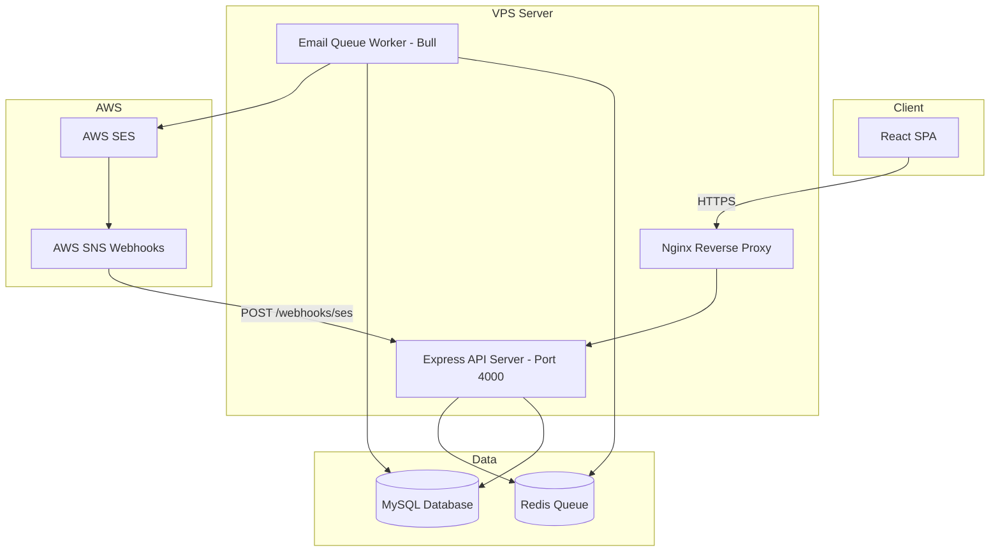
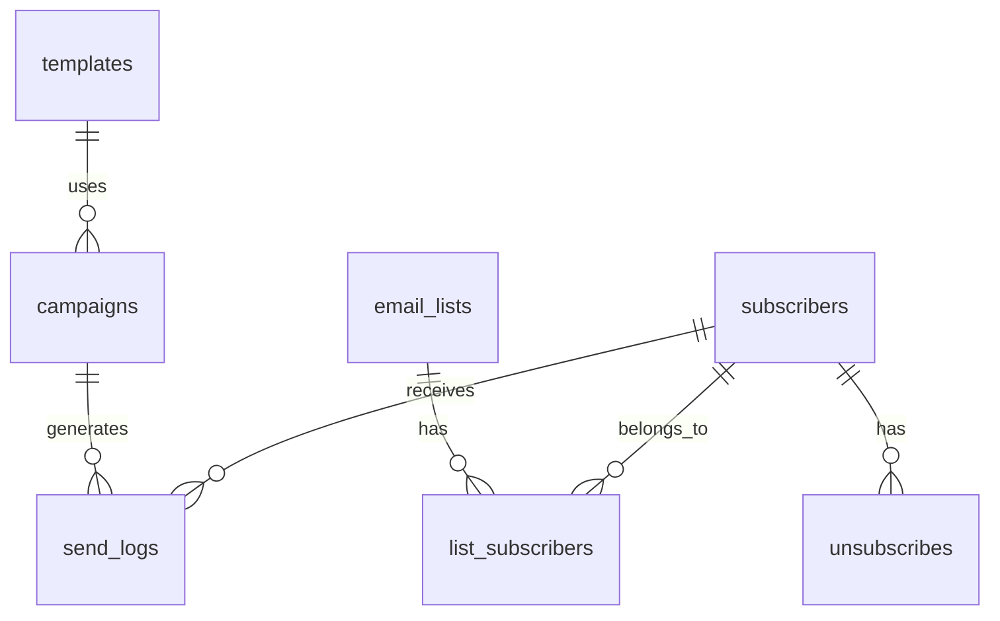
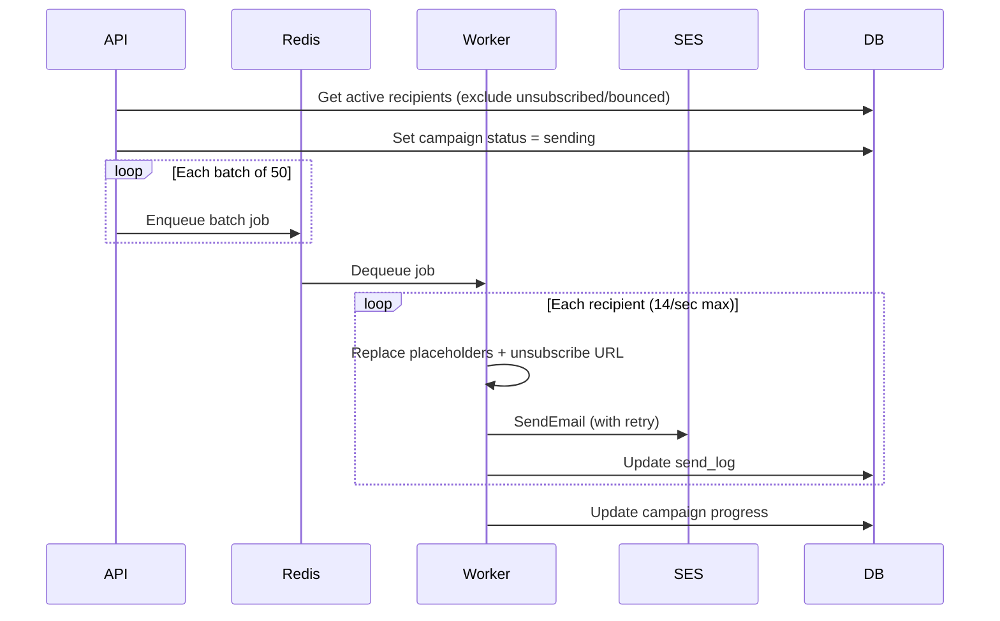

# Email Marketing Application — Complete Documentation

**Version:** 1.0.0  
**Stack:** React + Node.js + MySQL + Redis + AWS SES  
**Organization:** Encycdata Pvt Ltd

---

## Table of Contents

1. [Overview](#1-overview)
2. [System Architecture](#2-system-architecture)
3. [Project Structure](#3-project-structure)
4. [Prerequisites](#4-prerequisites)
5. [Installation & Setup](#5-installation--setup)
6. [Environment Configuration](#6-environment-configuration)
7. [Database Schema](#7-database-schema)
8. [Feature Modules](#8-feature-modules)
9. [API Reference](#9-api-reference)
10. [Email Templates & Placeholders](#10-email-templates--placeholders)
11. [Bulk Email Engine](#11-bulk-email-engine)
12. [AWS SES Integration](#12-aws-ses-integration)
13. [Unsubscribe Management](#13-unsubscribe-management)
14. [Reports & Analytics](#14-reports--analytics)
15. [Deployment Guide](#15-deployment-guide)
16. [AWS Credential Migration](#16-aws-credential-migration)
17. [Testing Checklist](#17-testing-checklist)
18. [Troubleshooting](#18-troubleshooting)

---

## 1. Overview

The Email Marketing Application is a full-stack platform for managing email lists, designing templates, running bulk campaigns, and tracking delivery — all powered by **AWS Simple Email Service (SES)**.

### Key Capabilities

- Manage email lists and subscribers with CSV/Excel import
- Create HTML email templates with dynamic placeholders
- Run immediate or scheduled bulk email campaigns
- Process lakhs of emails via Redis queue with rate limiting
- Track delivery, bounces, complaints, and unsubscribes
- Switch from test to production AWS SES by changing `.env` only

### Technology Stack

| Layer | Technology |
|-------|-----------|
| Frontend | React 18, Vite, Tailwind CSS, React Router, Axios |
| Backend | Node.js, Express, Sequelize ORM |
| Database | MySQL 8 |
| Queue | Redis + Bull |
| Email | AWS SDK v3 (SES) |
| Process Manager | PM2 |
| Web Server | Nginx |

---

## 2. System Architecture



### Request Flow

1. User interacts with the React frontend
2. Frontend calls REST API on the backend
3. Campaign send requests enqueue batch jobs in Redis
4. Email worker picks up jobs, sends via AWS SES
5. SES sends bounce/complaint/delivery events to SNS
6. SNS posts webhooks back to the API
7. API updates subscriber and send log status in MySQL

---

## 3. Project Structure

```
cc-app-email-marketing-AWS-SES/
│
├── backend/                        # Node.js API
│   ├── src/
│   │   ├── config/
│   │   │   ├── index.js            # Central config (reads .env)
│   │   │   └── database.js         # Sequelize connection
│   │   ├── controllers/            # HTTP request handlers
│   │   │   ├── emailList.controller.js
│   │   │   ├── segment.controller.js
│   │   │   ├── template.controller.js
│   │   │   ├── campaign.controller.js
│   │   │   ├── unsubscribe.controller.js
│   │   │   ├── webhook.controller.js
│   │   │   └── reports.controller.js
│   │   ├── database/
│   │   │   └── migrate.js          # DB table sync script
│   │   ├── middleware/
│   │   │   ├── index.js            # Error handler, validation
│   │   │   └── validators.js       # express-validator rules
│   │   ├── models/
│   │   │   └── index.js            # All Sequelize models
│   │   ├── routes/
│   │   │   └── index.js            # API route definitions
│   │   ├── services/
│   │   │   ├── ses.service.js      # AWS SES wrapper
│   │   │   ├── queue.service.js    # Bull queue setup
│   │   │   ├── campaign.service.js # Campaign orchestration
│   │   │   ├── email.service.js    # Batch email processing
│   │   │   └── import.service.js   # CSV/Excel import
│   │   ├── utils/
│   │   │   ├── helpers.js          # Pagination, email validation
│   │   │   └── token.js            # Unsubscribe token HMAC
│   │   ├── workers/
│   │   │   └── emailWorker.js      # Bull queue consumer
│   │   ├── app.js
│   │   └── server.js
│   ├── .env.example
│   └── package.json
│
├── frontend/                       # React SPA
│   ├── src/
│   │   ├── components/
│   │   │   ├── Layout.jsx          # Sidebar navigation
│   │   │   └── common.jsx          # Shared UI components
│   │   ├── pages/
│   │   │   ├── Dashboard.jsx
│   │   │   ├── EmailLists.jsx
│   │   │   ├── Subscribers.jsx
│   │   │   ├── Segments.jsx
│   │   │   ├── Templates.jsx
│   │   │   ├── Campaigns.jsx
│   │   │   ├── CampaignDetail.jsx
│   │   │   ├── Reports.jsx
│   │   │   └── Unsubscribe.jsx     # Public unsubscribe page
│   │   ├── services/
│   │   │   └── api.js              # Axios API client
│   │   ├── App.jsx
│   │   └── main.jsx
│   ├── .env.example
│   └── package.json
│
├── deployment/
│   ├── nginx.conf                  # Nginx virtual host config
│   └── ecosystem.config.js         # PM2 process config
│
└── docs/
    ├── DOCUMENTATION.md            # This file
    └── ARCHITECTURE.md             # Architecture diagrams
```

---

## 4. Prerequisites

| Requirement | Version | Purpose |
|------------|---------|---------|
| Node.js | 18+ | Runtime |
| MySQL | 8+ | Data storage |
| Redis | 6+ | Email queue (Bull) |
| AWS SES Account | — | Email delivery |
| npm | 9+ | Package management |

**Optional for production:**

- VPS (Ubuntu 22.04 recommended)
- Nginx
- PM2
- Domain with DNS access (for SES verification)

---

## 5. Installation & Setup

### 5.1 Backend

```bash
cd backend
cp .env.example .env
```

Edit `.env` with your MySQL, Redis, and AWS SES credentials (see [Section 6](#6-environment-configuration)).

```bash
npm install
npm run migrate        # Creates all database tables
npm run dev            # Starts API on http://localhost:4000
```

### 5.2 Email Worker

The worker must run as a **separate process** to process the email queue:

```bash
cd backend
npm run worker
```

### 5.3 Frontend

```bash
cd frontend
cp .env.example .env
npm install
npm run dev            # Starts UI on http://localhost:5173
```

### 5.4 Verify Installation

| Check | URL |
|-------|-----|
| API Health | http://localhost:4000/api/v1/health |
| Frontend | http://localhost:5173 |
| Worker | Terminal shows "Email worker ready and listening for jobs" |

---

## 6. Environment Configuration

### 6.1 Backend Variables

Copy `backend/.env.example` to `backend/.env`:

```env
# Server
NODE_ENV=development
PORT=4000
API_PREFIX=/api/v1

# MySQL
DB_HOST=localhost
DB_PORT=3306
DB_NAME=email_marketing
DB_USER=root
DB_PASSWORD=your_password

# Redis
REDIS_HOST=localhost
REDIS_PORT=6379
REDIS_PASSWORD=

# AWS SES
AWS_ACCESS_KEY_ID=your_access_key
AWS_SECRET_ACCESS_KEY=your_secret_key
AWS_REGION=us-east-1
SES_FROM_EMAIL=noreply@yourdomain.com
SES_FROM_NAME=Email Marketing

# Application
APP_URL=http://localhost:5173
API_URL=http://localhost:4000
UNSUBSCRIBE_SECRET=change-this-to-a-random-secret

# Email Engine
EMAIL_BATCH_SIZE=50
EMAIL_RATE_LIMIT_PER_SECOND=14
EMAIL_MAX_RETRIES=3
EMAIL_RETRY_DELAY_MS=5000
```

### 6.2 Frontend Variables

Copy `frontend/.env.example` to `frontend/.env`:

```env
VITE_API_URL=http://localhost:4000/api/v1
```

### 6.3 Environment Profiles

| Environment | NODE_ENV | Notes |
|------------|----------|-------|
| Development | `development` | Local MySQL, Redis, test SES credentials |
| Staging | `staging` | Staging VPS, test SES credentials |
| Production | `production` | Production VPS, production SES credentials |

PM2 supports all three via `ecosystem.config.js`:

```bash
pm2 start deployment/ecosystem.config.js --env development
pm2 start deployment/ecosystem.config.js --env staging
pm2 start deployment/ecosystem.config.js --env production
```

---

## 7. Database Schema

### 7.1 Tables

| Table | Description |
|-------|-------------|
| `email_lists` | Named collections of subscribers |
| `subscribers` | Individual email contacts |
| `list_subscribers` | Many-to-many: lists ↔ subscribers |
| `email_segments` | Subscriber groupings for targeting |
| `segment_subscribers` | Many-to-many: segments ↔ subscribers |
| `import_logs` | CSV/Excel import history and status |
| `templates` | HTML email templates |
| `campaigns` | Email campaign definitions |
| `campaign_lists` | Lists targeted by a campaign |
| `campaign_segments` | Segments targeted by a campaign |
| `send_logs` | Per-recipient send status |
| `campaign_logs` | Campaign action history |
| `unsubscribes` | Unsubscribe records |
| `bounce_logs` | SES bounce events |
| `complaint_logs` | SES complaint events |

### 7.2 Key Relationships



### 7.3 Subscriber Status Values

| Status | Description |
|--------|-------------|
| `active` | Can receive emails |
| `unsubscribed` | Opted out via unsubscribe link |
| `bounced` | Hard/soft bounce from SES |
| `complained` | Marked as spam via SES |

### 7.4 Campaign Status Values

| Status | Description |
|--------|-------------|
| `draft` | Created, not yet sent |
| `scheduled` | Waiting for scheduled time |
| `sending` | Currently processing |
| `paused` | Manually paused |
| `completed` | All emails processed |
| `failed` | Campaign failed |
| `cancelled` | Manually cancelled |

### 7.5 Run Migrations

```bash
cd backend
npm run migrate
```

This runs Sequelize `sync({ alter: true })` to create or update all tables.

---

## 8. Feature Modules

### Story 1 — Project Setup & Architecture

- Separate React frontend and Node.js backend
- MySQL database with Sequelize ORM
- Environment-based configuration via `.env`
- Nginx and PM2 deployment configs
- Development, staging, and production environment support

### Story 2 — Email List Management

- Create, edit, archive email lists
- Add/edit/delete individual subscribers
- Import subscribers from CSV or Excel (`.csv`, `.xlsx`, `.xls`)
- Duplicate email detection on import
- Email format validation (`user@domain.com`)
- Search by email, first name, last name
- Filter by status and list
- Email segmentation via segments module
- Paginated list and subscriber views
- Import status logging (imported, duplicate, invalid counts)

**Import file format:**

| email | first_name | last_name |
|-------|-----------|-----------|
| john@example.com | John | Doe |
| jane@example.com | Jane | Smith |

### Story 3 — Email Template Management

- Full template CRUD via API and UI
- HTML email body support
- Plain text body (optional fallback)
- File attachments (base64 in JSON)
- Dynamic placeholders (see [Section 10](#10-email-templates--placeholders))
- Live preview with sample data
- One-click template duplication

### Story 4 — Campaign Management

- Create campaigns with name, template, and recipient groups
- Select one or more email lists and/or segments
- Schedule for a future date/time or send immediately
- Campaign status lifecycle: draft → sending → completed
- Pause and resume in-progress campaigns
- Campaign action history log
- Per-recipient send log with status

### Story 5 — AWS SES Integration

- AWS SDK v3 (`@aws-sdk/client-ses`)
- `SESService` wrapper class for all SES operations
- `SendEmail` for standard HTML/text emails
- `SendRawEmail` for emails with attachments
- Automatic retry on throttling and transient errors
- SNS webhook handler for bounces, complaints, and deliveries
- All credentials read from environment variables only

### Story 6 — Bulk Email Engine

- Redis-backed Bull queue (`email-campaign-queue`)
- Configurable batch size (default: 50 recipients per job)
- Rate limiting (default: 14 emails/second)
- Exponential backoff retry (default: 3 attempts)
- Processes large volumes (lakhs) in background batches
- Per-email send status logging
- Failed email tracking with error messages
- Campaign resume from last processed point

### Story 7 — Unsubscribe Management

- HMAC-signed unsubscribe tokens per subscriber/campaign
- `{{unsubscribe_url}}` auto-injected into every email
- Public unsubscribe page at `/unsubscribe/:token`
- Subscriber status updated to `unsubscribed`
- Unsubscribed users excluded from all future sends
- Unsubscribe report with reason and timestamp
- Full unsubscribe history in database

### Story 8 — Email Tracking & Reports

- Send log per recipient per campaign
- Delivery status tracking via SES webhooks
- Bounce and complaint logging
- Unsubscribe tracking
- Dashboard with subscriber and email metrics
- Campaign analytics (delivery rate, bounce rate)
- CSV export for send logs and unsubscribes

### Story 9 — Testing & Deployment

- Health check endpoint for smoke tests
- PM2 ecosystem for API + worker processes
- Nginx config for separate frontend and API domains
- Full deployment documentation (see [Section 15](#15-deployment-guide))

### Story 10 — AWS Credential Migration

**Acceptance Criteria:** Changing only `.env` credentials from test to production AWS SES account makes the entire application work without any code modification.

Only these four variables need to change:

```env
AWS_ACCESS_KEY_ID=
AWS_SECRET_ACCESS_KEY=
AWS_REGION=
SES_FROM_EMAIL=
```

---

## 9. API Reference

**Base URL:** `http://localhost:4000/api/v1`  
**Content-Type:** `application/json` (unless noted)

### 9.1 Health

```
GET /health
```

**Response:**
```json
{ "success": true, "message": "Email Marketing API is running" }
```

---

### 9.2 Email Lists

| Method | Endpoint | Description |
|--------|----------|-------------|
| GET | `/lists` | List all email lists (paginated) |
| GET | `/lists/:id` | Get list with subscribers |
| POST | `/lists` | Create a new list |
| PUT | `/lists/:id` | Update a list |
| DELETE | `/lists/:id` | Archive a list |
| POST | `/lists/:id/import` | Import CSV/Excel file |
| GET | `/lists/:id/import-logs` | Get import history |

**Create List — POST `/lists`**
```json
{
  "name": "Newsletter Subscribers",
  "description": "Monthly newsletter list"
}
```

**Import — POST `/lists/:id/import`**  
Content-Type: `multipart/form-data`  
Field: `file` (CSV or Excel, max 10 MB)

**Query Parameters (GET `/lists`):**

| Param | Type | Description |
|-------|------|-------------|
| `page` | int | Page number (default: 1) |
| `limit` | int | Items per page (default: 20, max: 100) |
| `search` | string | Search by name or description |
| `status` | string | Filter: `active` or `archived` |

---

### 9.3 Subscribers

| Method | Endpoint | Description |
|--------|----------|-------------|
| GET | `/subscribers` | List subscribers (paginated, filterable) |
| POST | `/subscribers` | Add subscriber to a list |
| PUT | `/subscribers/:id` | Update subscriber |
| DELETE | `/subscribers/:id` | Remove from list or mark unsubscribed |

**Add Subscriber — POST `/subscribers`**
```json
{
  "email": "user@example.com",
  "firstName": "John",
  "lastName": "Doe",
  "listId": 1
}
```

**Query Parameters (GET `/subscribers`):**

| Param | Type | Description |
|-------|------|-------------|
| `page` | int | Page number |
| `limit` | int | Items per page |
| `search` | string | Search email or name |
| `status` | string | `active`, `unsubscribed`, `bounced`, `complained` |
| `listId` | int | Filter by list |

---

### 9.4 Segments

| Method | Endpoint | Description |
|--------|----------|-------------|
| GET | `/segments` | List all segments |
| GET | `/segments/:id` | Get segment with subscribers |
| POST | `/segments` | Create segment |
| PUT | `/segments/:id` | Update segment |
| DELETE | `/segments/:id` | Delete segment |

**Create Segment — POST `/segments`**
```json
{
  "name": "Premium Users",
  "description": "High-value subscribers",
  "subscriberIds": [1, 2, 3]
}
```

---

### 9.5 Templates

| Method | Endpoint | Description |
|--------|----------|-------------|
| GET | `/templates` | List templates |
| GET | `/templates/:id` | Get template by ID |
| POST | `/templates` | Create template |
| PUT | `/templates/:id` | Update template |
| DELETE | `/templates/:id` | Archive template |
| POST | `/templates/:id/duplicate` | Duplicate template |
| POST | `/templates/:id/preview` | Preview with sample data |

**Create Template — POST `/templates`**
```json
{
  "name": "Welcome Email",
  "subject": "Welcome, {{first_name}}!",
  "htmlBody": "<h1>Hello {{first_name}}</h1><p>Thanks for subscribing.</p><a href=\"{{unsubscribe_url}}\">Unsubscribe</a>",
  "textBody": "Hello {{first_name}}. Unsubscribe: {{unsubscribe_url}}",
  "placeholders": ["{{first_name}}", "{{unsubscribe_url}}"],
  "attachments": []
}
```

**Preview — POST `/templates/:id/preview`**
```json
{
  "sampleData": {
    "firstName": "John",
    "lastName": "Doe",
    "email": "john@example.com"
  }
}
```

---

### 9.6 Campaigns

| Method | Endpoint | Description |
|--------|----------|-------------|
| GET | `/campaigns` | List campaigns |
| GET | `/campaigns/:id` | Get campaign details |
| POST | `/campaigns` | Create campaign |
| PUT | `/campaigns/:id` | Update campaign (draft/scheduled only) |
| DELETE | `/campaigns/:id` | Cancel campaign |
| POST | `/campaigns/:id/send` | Start or send campaign |
| POST | `/campaigns/:id/pause` | Pause sending campaign |
| POST | `/campaigns/:id/resume` | Resume paused/failed campaign |
| GET | `/campaigns/:id/logs` | Campaign action history |
| GET | `/campaigns/:id/send-logs` | Per-recipient send logs |

**Create Campaign — POST `/campaigns`**
```json
{
  "name": "March Newsletter",
  "templateId": 1,
  "listIds": [1, 2],
  "segmentIds": [3],
  "scheduleType": "immediate"
}
```

**Scheduled Campaign:**
```json
{
  "name": "April Promo",
  "templateId": 2,
  "listIds": [1],
  "segmentIds": [],
  "scheduleType": "scheduled",
  "scheduledAt": "2026-04-01T09:00:00.000Z"
}
```

**Campaign Status Flow:**

```
draft → sending → completed
draft → scheduled → sending → completed
sending → paused → sending (resume)
sending → failed → sending (resume)
any → cancelled
```

---

### 9.7 Unsubscribe (Public)

| Method | Endpoint | Description |
|--------|----------|-------------|
| GET | `/unsubscribe/:token` | Check unsubscribe status |
| POST | `/unsubscribe/:token` | Confirm unsubscribe |
| GET | `/unsubscribes/report` | Unsubscribe report (admin) |

**Unsubscribe — POST `/unsubscribe/:token`**
```json
{
  "reason": "Too many emails"
}
```

---

### 9.8 Webhooks

| Method | Endpoint | Description |
|--------|----------|-------------|
| POST | `/webhooks/ses` | AWS SNS notification handler |

Configure this URL in AWS SNS as the HTTPS endpoint:
```
https://api.email.yourdomain.com/api/v1/webhooks/ses
```

Handles: `Bounce`, `Complaint`, `Delivery`, `SubscriptionConfirmation`

---

### 9.9 Reports

| Method | Endpoint | Description |
|--------|----------|-------------|
| GET | `/reports/dashboard` | Overall metrics |
| GET | `/reports/campaigns/:id/analytics` | Campaign-specific analytics |
| GET | `/reports/export/send-logs` | Export send logs as CSV |
| GET | `/reports/export/unsubscribes` | Export unsubscribes as CSV |

**Dashboard Response:**
```json
{
  "success": true,
  "data": {
    "subscribers": { "total": 10000, "active": 9500, "unsubscribed": 400, "bounced": 100 },
    "campaigns": { "total": 25, "completed": 20 },
    "emails": { "sent": 50000, "delivered": 48000, "failed": 500, "bounces": 300, "complaints": 50 }
  }
}
```

---

## 10. Email Templates & Placeholders

### Supported Placeholders

| Placeholder | Replaced With |
|------------|--------------|
| `{{first_name}}` | Subscriber first name |
| `{{last_name}}` | Subscriber last name |
| `{{email}}` | Subscriber email address |
| `{{full_name}}` | First + last name (falls back to email) |
| `{{unsubscribe_url}}` | Signed unsubscribe link (auto-generated) |

Placeholders are case-insensitive and work in both `subject` and `htmlBody`/`textBody`.

### Example Template

```html
<!DOCTYPE html>
<html>
<body>
  <h1>Hello {{first_name}}!</h1>
  <p>We're glad to have you, {{email}}.</p>
  <p>
    <a href="{{unsubscribe_url}}">Unsubscribe</a> from future emails.
  </p>
</body>
</html>
```

### Attachments

Attachments are stored as JSON in the template:

```json
{
  "attachments": [
    {
      "filename": "brochure.pdf",
      "contentType": "application/pdf",
      "content": "<base64-encoded-content>"
    }
  ]
}
```

When attachments are present, the system uses `SendRawEmail` instead of `SendEmail`.

---

## 11. Bulk Email Engine

### How It Works



### Configuration

| Variable | Default | Description |
|----------|---------|-------------|
| `EMAIL_BATCH_SIZE` | 50 | Recipients per queue job |
| `EMAIL_RATE_LIMIT_PER_SECOND` | 14 | Max sends per second |
| `EMAIL_MAX_RETRIES` | 3 | Retry attempts per email |
| `EMAIL_RETRY_DELAY_MS` | 5000 | Base delay between retries |

### Pause & Resume

- **Pause:** Sets campaign status to `paused`, removes pending queue jobs
- **Resume:** Re-queues only unsent recipients, skips already-sent logs
- Already-sent recipients are never duplicated

### Processing Large Volumes

For 1,00,000 emails with default settings:
- 2,000 batch jobs (50 per batch)
- ~2 hours at 14 emails/second
- All processing happens in background via worker

---

## 12. AWS SES Integration

### Setup Steps (Manual — Outside Application)

> **Developer guide:** See [AWS SES Setup Guide](./AWS-SES-SETUP-GUIDE.md) for step-by-step IAM user creation, domain verification, DNS, SNS webhooks, and production access.

1. Create AWS account and enable SES in your chosen region
2. Verify sending domain or email address
3. Add DNS records:
   - **SPF:** `v=spf1 include:amazonses.com ~all`
   - **DKIM:** CNAME records provided by SES console
   - **DMARC:** `v=DMARC1; p=quarantine; rua=mailto:dmarc@yourdomain.com`
4. Create SNS topics for Bounce, Complaint, and Delivery
5. Subscribe HTTPS endpoint: `https://api.email.yourdomain.com/api/v1/webhooks/ses`
6. Request production access (move out of SES sandbox)
7. Create IAM user with `ses:SendEmail` and `ses:SendRawEmail` permissions
8. Add credentials to `backend/.env`

### SES Service (`backend/src/services/ses.service.js`)

All AWS configuration is read from `backend/src/config/index.js`, which loads from `.env`:

```javascript
aws: {
  accessKeyId: process.env.AWS_ACCESS_KEY_ID,
  secretAccessKey: process.env.AWS_SECRET_ACCESS_KEY,
  region: process.env.AWS_REGION,
  fromEmail: process.env.SES_FROM_EMAIL,
  fromName: process.env.SES_FROM_NAME,
}
```

### Retry Logic

Automatically retries on:
- `Throttling`
- `ServiceUnavailable`
- `InternalFailure`
- `RequestTimeout`
- `TooManyRequestsException`

Non-retryable errors (invalid email, unverified domain) fail immediately and are logged.

---

## 13. Unsubscribe Management

### Token Generation

Each email contains a unique HMAC-signed token:

```
payload = subscriberId:email:campaignId
token = base64url(payload + HMAC-SHA256(payload, UNSUBSCRIBE_SECRET))
```

### Unsubscribe URL Format

```
https://email.yourdomain.com/unsubscribe/{token}
```

Set `APP_URL` in backend `.env` to control the base URL.

### Flow

1. Recipient clicks unsubscribe link in email
2. Frontend loads `/unsubscribe/:token`
3. API verifies token signature
4. User confirms unsubscribe (optional reason)
5. Subscriber status → `unsubscribed`
6. Record saved in `unsubscribes` table
7. Future campaigns exclude this subscriber automatically

---

## 14. Reports & Analytics

### Dashboard Metrics

- Total / active / unsubscribed / bounced subscribers
- Total / completed campaigns
- Emails sent, delivered, failed, bounced, complained
- Recent campaigns list

### Campaign Analytics

Per-campaign metrics:
- Total recipients, sent, delivered, failed, bounced, complained, pending
- Delivery rate (%)
- Bounce rate (%)

### CSV Exports

| Export | Endpoint |
|--------|----------|
| Send Logs | `GET /reports/export/send-logs?campaignId=1&status=failed` |
| Unsubscribes | `GET /reports/export/unsubscribes` |

---

## 15. Deployment Guide

### 15.1 Server Requirements

- Ubuntu 22.04 LTS VPS
- 2+ GB RAM
- Node.js 18+, MySQL 8, Redis 6, Nginx, PM2

### 15.2 Database Setup

```sql
CREATE DATABASE email_marketing
  CHARACTER SET utf8mb4
  COLLATE utf8mb4_unicode_ci;

CREATE USER 'emailapp'@'localhost' IDENTIFIED BY 'secure_password';
GRANT ALL PRIVILEGES ON email_marketing.* TO 'emailapp'@'localhost';
FLUSH PRIVILEGES;
```

### 15.3 Deploy Application

```bash
# Backend
cd /var/www/email-marketing/backend
cp .env.example .env
# Edit .env with production values
npm install --production
npm run migrate

# Frontend
cd /var/www/email-marketing/frontend
cp .env.example .env
# Set VITE_API_URL=https://api.email.yourdomain.com/api/v1
npm install
npm run build
```

### 15.4 Start with PM2

```bash
cd /var/www/email-marketing
pm2 start deployment/ecosystem.config.js --env production
pm2 save
pm2 startup
```

PM2 runs two processes:
- `email-marketing-api` — Express API server
- `email-marketing-worker` — Bull queue email processor

### 15.5 Configure Nginx

```bash
sudo cp deployment/nginx.conf /etc/nginx/sites-available/email-marketing
sudo ln -s /etc/nginx/sites-available/email-marketing /etc/nginx/sites-enabled/
sudo nginx -t
sudo systemctl reload nginx
```

Update domains in `deployment/nginx.conf`:
- `email.yourdomain.com` → Frontend
- `api.email.yourdomain.com` → Backend API

### 15.6 SSL Certificate

```bash
sudo apt install certbot python3-certbot-nginx
sudo certbot --nginx -d email.yourdomain.com -d api.email.yourdomain.com
```

### 15.7 Domain Layout

| Domain | Serves |
|--------|--------|
| `email.yourdomain.com` | React frontend (Nginx static) |
| `api.email.yourdomain.com` | Node.js API (Nginx proxy → :4000) |

---

## 16. AWS Credential Migration

### From Test to Production

This is the primary acceptance criterion for Story 10. **No code changes are required.**

**Step 1:** Complete all development and testing with test SES credentials.

**Step 2:** Set up production AWS SES account (domain verification, SNS, production access).

**Step 3:** Update only these four values in `backend/.env`:

```env
AWS_ACCESS_KEY_ID=AKIA...production...
AWS_SECRET_ACCESS_KEY=...production_secret...
AWS_REGION=us-east-1
SES_FROM_EMAIL=noreply@yourproductiondomain.com
```

**Step 4:** Restart processes:

```bash
pm2 restart all
```

**Step 5:** Run smoke tests (see [Section 17](#17-testing-checklist)).

### What Does NOT Change

- Application source code
- Database schema
- Redis configuration
- Frontend code
- Queue worker logic
- Webhook endpoints
- Template content

---

## 17. Testing Checklist

### AWS SES Integration

- [ ] Send a single test email via a campaign
- [ ] Verify email arrives in inbox (not spam)
- [ ] Check `send_logs` table for `sent` status and `ses_message_id`

### Inbox Delivery

- [ ] Send to Gmail, Outlook, and Yahoo test accounts
- [ ] Verify SPF, DKIM, DMARC pass (check email headers)

### Unsubscribe Flow

- [ ] Click unsubscribe link in a test email
- [ ] Confirm subscriber status changes to `unsubscribed`
- [ ] Verify subscriber is excluded from next campaign

### Bulk Sending

- [ ] Run campaign with 100+ recipients
- [ ] Monitor worker logs: `pm2 logs email-marketing-worker`
- [ ] Verify batch processing and rate limiting
- [ ] Check campaign completes with correct sent/failed counts

### Pause & Resume

- [ ] Start a large campaign, pause mid-send
- [ ] Verify no new emails sent while paused
- [ ] Resume and verify remaining emails are sent (no duplicates)

### Webhooks

- [ ] Trigger a test bounce in SES sandbox
- [ ] Verify `bounce_logs` table updated
- [ ] Verify subscriber status set to `bounced`

### Credential Migration (Production)

- [ ] Replace `.env` AWS credentials with production values
- [ ] Restart PM2: `pm2 restart all`
- [ ] Send test email — verify delivery
- [ ] Run small campaign (10 recipients) — verify all sent
- [ ] Verify unsubscribe link works with production domain

---

## 18. Troubleshooting

### API won't start

```bash
# Check database connection
cd backend && node -e "require('./src/config/database').authenticate().then(() => console.log('OK')).catch(console.error)"
```

Verify `DB_HOST`, `DB_USER`, `DB_PASSWORD` in `.env`.

### Worker not processing emails

```bash
# Check Redis is running
redis-cli ping   # Should return PONG

# Check queue
redis-cli LLEN bull:email-campaign-queue:wait

# View worker logs
pm2 logs email-marketing-worker
```

### Emails not sending (SES errors)

| Error | Cause | Fix |
|-------|-------|-----|
| `MessageRejected` | Unverified sender | Verify `SES_FROM_EMAIL` in SES console |
| `Throttling` | Rate limit exceeded | Lower `EMAIL_RATE_LIMIT_PER_SECOND` |
| `AccessDenied` | Invalid IAM credentials | Check `AWS_ACCESS_KEY_ID` and permissions |
| Sandbox restriction | SES in sandbox mode | Verify recipient emails or request production access |

### Import fails

- Ensure file has an `email` column header
- Supported formats: `.csv`, `.xlsx`, `.xls`
- Max file size: 10 MB
- Check import logs: `GET /api/v1/lists/:id/import-logs`

### Webhooks not received

- Confirm SNS subscription is confirmed
- Check webhook URL is publicly accessible via HTTPS
- Review API logs: `pm2 logs email-marketing-api`

### Frontend can't reach API

- Verify `VITE_API_URL` in `frontend/.env`
- Check CORS: `APP_URL` in backend `.env` must match frontend URL
- In development, Vite proxy handles `/api` → `:4000`

---

## NPM Scripts Reference

### Backend

| Script | Command | Description |
|--------|---------|-------------|
| `npm run dev` | `nodemon src/server.js` | Development API server |
| `npm start` | `node src/server.js` | Production API server |
| `npm run worker` | `node src/workers/emailWorker.js` | Start queue worker |
| `npm run migrate` | `node src/database/migrate.js` | Sync database tables |

### Frontend

| Script | Command | Description |
|--------|---------|-------------|
| `npm run dev` | `vite` | Development server |
| `npm run build` | `vite build` | Production build |
| `npm run preview` | `vite preview` | Preview production build |

---

*Documentation generated for Encycdata Pvt Ltd — Email Marketing Application v1.0.0*
